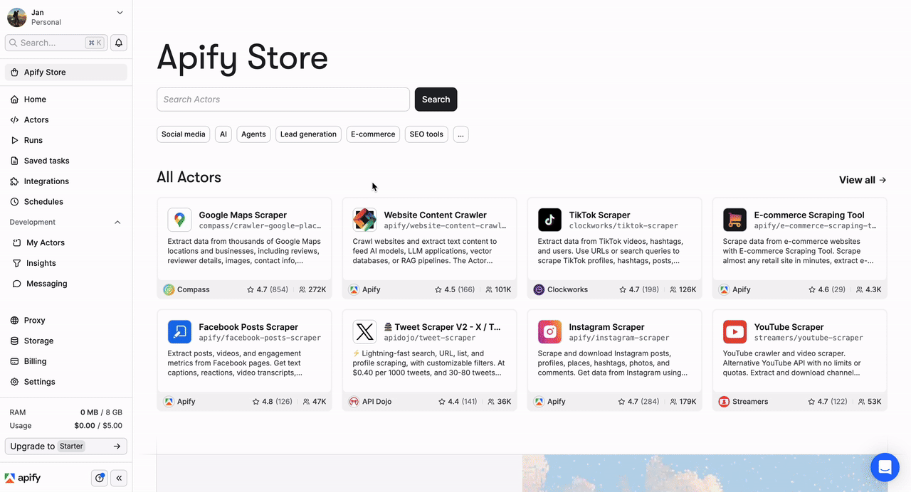
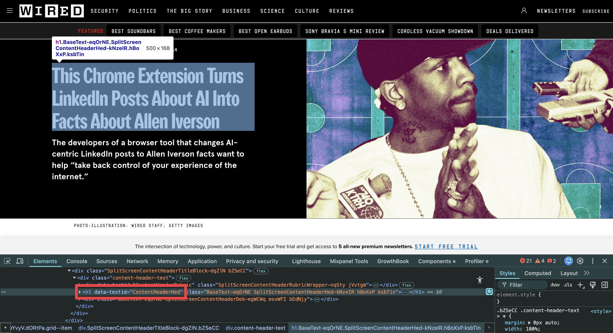
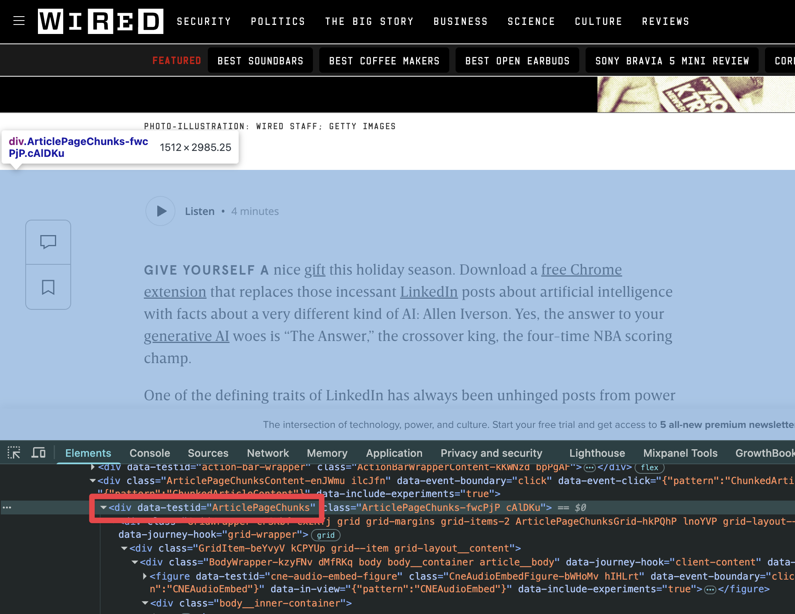
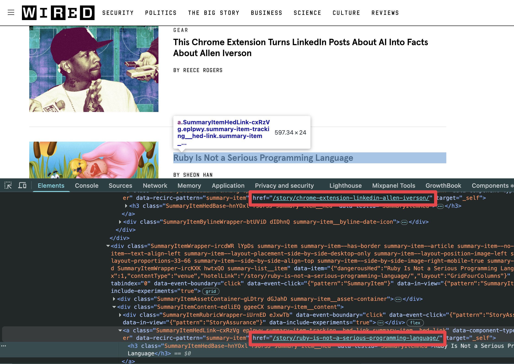
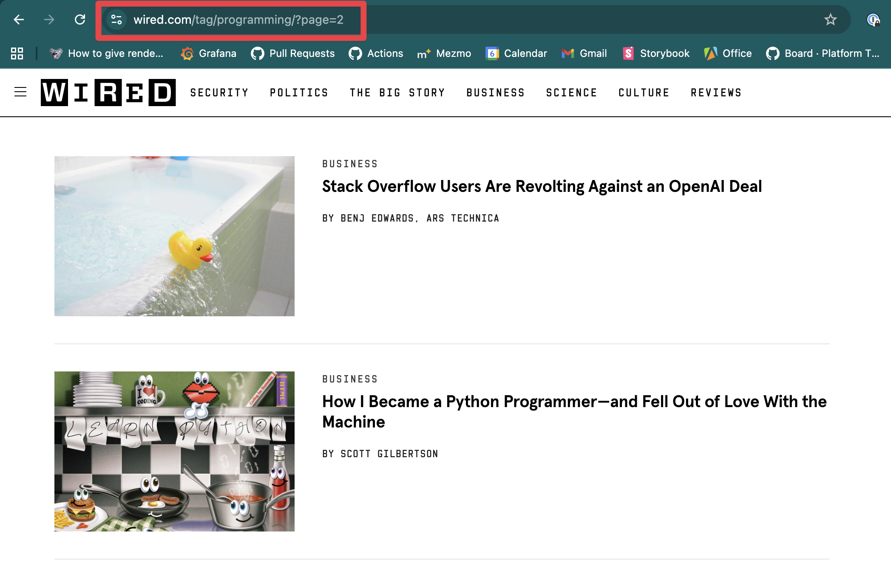
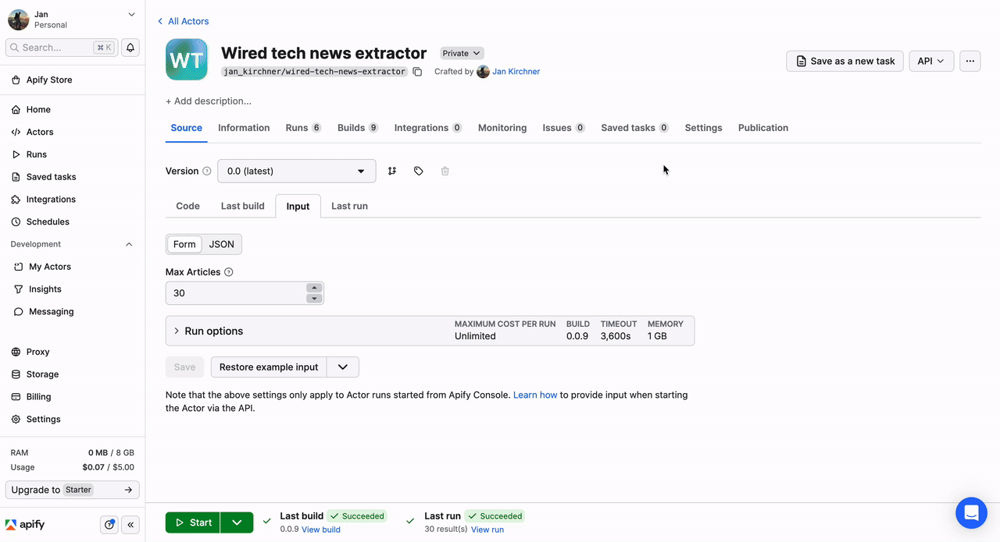
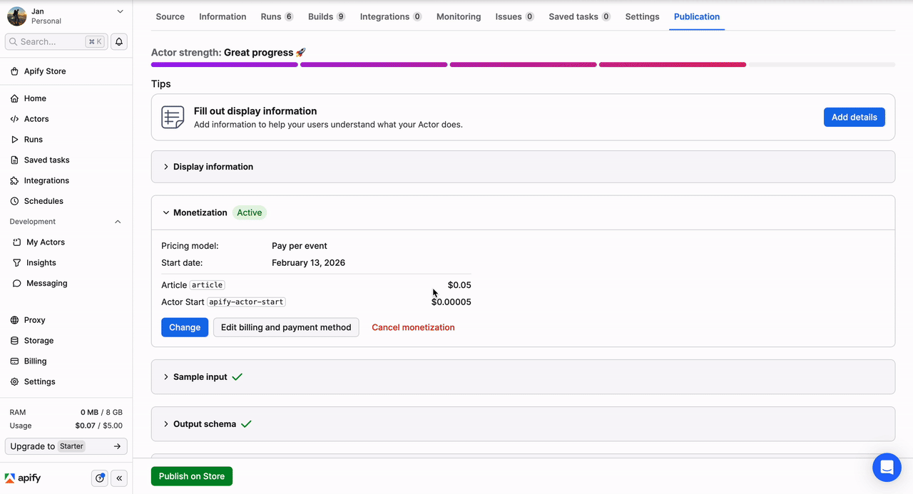

# Wired tech articles extractor

Example Actor to demonstrate how to create an Actor using Crawlee on Apify platform. It scrapes the latest articles from [Wired about programming](https://www.wired.com/tag/programming/), generates their summary using OpenAI and charges users for each result.

#### Prerequisites

- [Apify account](https://console.apify.com/sign-in)

### Create an Actor from template
- navigate to [*My Actors*]([https:](https://console.apify.com/actors/development)) page
- click on [*Develop new*](https://console.apify.com/actors/new) button
- select [*Quick start: Crawlee + BeautifulSoup (Python)*](https://console.apify.com/actors/templates/python-crawlee-beautifulsoup) template 
- click on *Use this template*
- hover the Actor name and click on the edit icon
- give your Actor a name and save the form

<div style="margin-bottom: 20px">
    
</div>

> Actor file structure 
> ```text
> .actor/
> ├── actor.json # Actor config: name, version, env vars, runtime settings
> ├── dataset_schema.json # Structure and representation of data produced by an Actor
> ├── input_schema.json # Input validation & Console form definition
> └── output_schema.json # Specifies where an Actor stores its output
> src/
> └── main.py # Actor entry point and orchestrator
> storage/ # Local storage (mirrors Cloud during development)
> ├── datasets/ # Output items (JSON objects)
> ├── key_value_stores/ # Files, config, INPUT
> └── request_queues/ # Pending crawl requests
> Dockerfile # Container image definition
> ```
> For more information, see the [Actor definition](https://docs.apify.com/platform/actors/development/actor-definition) documentation.


### Analyze the page

Before writing any scraping code, analyzing the target website's structure is crucial for successful web scraping. Understanding how the page is built allows you to identify the correct CSS selectors, detect patterns, and ensure your scraper works reliably across multiple pages.

**Why page analysis matters:**
- Identifies repeating patterns and data structures across pages
- Helps you find the most stable selectors (avoiding dynamic class names)
- Reveals pagination mechanisms and navigation patterns
- Allows you to spot potential anti-scraping measures early

**How to analyze a page:**
1. **Open Developer Tools** (F12 or right-click → Inspect)
2. **Use the Element Picker** (Ctrl+Shift+C / Cmd+Shift+C) to hover over elements you want to scrape
3. **Examine the HTML structure** - look for semantic tags, data attributes, and unique identifiers
4. **Check multiple pages** - verify that the structure is consistent across different articles/products
5. **Look for static attributes** - attributes like `id` or `data-testid` are more stable than generated class names
6. **Test CSS selectors in Console** - use `document.querySelector()` to verify your selectors work
7. **Inspect Network tab** - sometimes data comes from API calls rather than rendered HTML

#### Article detail page

On individual article pages, we need to extract two key pieces of information:

**Article title** - Located in an `<h1>` tag with `data-testid="ContentHeaderHed"` attribute

<div style="margin-bottom: 20px">
    
</div>

**Article content** - Found in a `<div>` with `data-testid="ArticlePageChunks"` attribute

<div style="margin-bottom: 20px">
    
</div>

> ℹ️ Notice how both elements use `data-testid` attributes - these are stable identifiers that are less likely to change than CSS classes, making our scraper more reliable.


#### Article list page

On the article listing page, we don't need to scrape any content directly. Instead, our goal is to collect all the article URLs so we can visit them later. 

Key observations:
- All article URLs follow the same pattern: `https://www.wired.com/story/**`
- This consistent URL structure allows us to use glob patterns to filter and enqueue only article links using the Crawlee's `enqueue_links()` method

<div style="margin-bottom: 20px">
    
</div>

## Implementation

Now that we've analyzed the page structure and identified the data we need, let's translate this into working code. We'll build two route handlers: one to collect article URLs from listing pages, and another to extract content from individual articles.

### Extracting article links from listing pages

The default handler processes listing pages and discovers all article URLs. We use Crawlee's `enqueue_links()` method to automatically find and queue matching links:

```python
@crawler.router.default_handler
async def request_handler(context: BeautifulSoupCrawlingContext) -> None:
    await context.enqueue_links(
        include=[Glob("https://www.wired.com/story/**")],
        label="ARTICLE"
    )
```

**What's happening here:**
- `include=[Glob(...)]` - Filters links to match only URLs following the pattern `https://www.wired.com/story/**`
- `label="ARTICLE"` - Tags these requests so they'll be handled by our article detail handler
- Crawlee automatically discovers all matching links on the page and adds them to the request queue

### Extracting content from article pages

The article handler processes individual article pages. We use Beautiful Soup's CSS selectors to extract the data we identified during page analysis:

```python
@crawler.router.handler(label="ARTICLE")
async def article_handler(context: BeautifulSoupCrawlingContext) -> None:
    title_el = context.soup.select_one('h1[data-testid="ContentHeaderHed"]')
    content_el = context.soup.select_one('div[data-testid="ArticlePageChunks"]')

    # Extract text and handle missing elements gracefully
    data = {
        'title': title_el.get_text() if title_el else None,
        'content': content_el.get_text() if content_el else None,
        'url': context.request.url,
    }

    # Save the extracted data to the dataset
    await context.push_data(data)
```

**Key points:**
- `@crawler.router.handler(label="ARTICLE")` - Processes only requests labeled as "ARTICLE"
- `context.soup.select_one()` - Beautiful Soup method to find elements using CSS selectors
- `await context.push_data(data)` - Saves the extracted data to the default dataset

**Try it!** 
- click on *Build* button
- once the build is done, navigate to the *input* tab
- click the *Start* button and see the magic happen


## Making the Actor configurable

### Defining user input

Currently, the scraper only processes a single page of results. To make it flexible and allow users to specify how many articles to scrape, we'll add configurable input parameters.

**Step 1: Create the input schema**

Edit `.actor/input_schema.json` to define what parameters users can configure:

```json
{
    "title": "Wired Tech Articles Scraper Input",
    "type": "object",
    "schemaVersion": 1,
    "properties": {
        "maxArticles": {
            "title": "Maximum Articles",
            "type": "integer",
            "description": "Maximum number of articles to scrape (24 articles per page)",
            "default": 24,
            "minimum": 1,
            "maximum": 500
        }
    },
    "required": []
}
```

This schema:
- Creates a form field in the Apify Console UI
- Validates user input (must be between 1-500)
- Sets a sensible default value (24)

**Step 2: Handle pagination**

Wired displays 24 articles per page. When users click "More stories", the URL changes to include a page parameter:

<div style="margin-bottom: 20px">
    
</div>

We need to calculate how many pages to visit based on the user's `maxArticles` input. Add this code to `src/main.py`:

```python
    ARTICLES_PER_PAGE = 24

    # Retrieve user input
    actor_input = await Actor.get_input() or {}
    max_articles = actor_input.get("maxArticles", ARTICLES_PER_PAGE)

    # Calculate how many listing pages we need to visit
    total_pages = ceil(max_articles / ARTICLES_PER_PAGE)
    base_url = "https://www.wired.com/tag/programming"

    # global state to know when to stop the crawler 
    processed_articles = 0

    # Generate URLs for all required pages
    start_urls = [
        base_url if page == 1 else f"{base_url}/?page={page}"
        for page in range(1, total_pages + 1)
    ]
```

Let's also update the `ARTICLE` route handler
```python
    nonlocal processed_articles

    if (processed_articles >= max_articles):
        if (processed_articles == max_articles):
            await Actor.set_status_message(f"Finishing scraping because we reached Maximum number of articles ({max_articles})")
        return
```

### Defining Actor output

Update `.actor/dataset_schema.json` so it describes the output expected by the Actor.

```json
{
    "actorSpecification": 1,
    "fields": {
        "type": "object",
        "properties": {
            "title": {
                "type": "string",
                "description": "Article title"
            },
            "content": {
                "type": "string",
                "description": "Full article text"
            },
            "url": {
                "type": "string",
                "description": "Article URL"
            }
        }
    },
    "views": {
        "overview": {
            "title": "Overview",
            "transformation": {
                "fields": ["title", "url", "content"]
            },
            "display": {
                "component": "table",
                "properties": {
                    "title": {
                        "label": "Title",
                        "format": "text"
                    },
                    "content": {
                        "label": "Content",
                        "format": "text"
                    },
                    "url": {
                        "label": "URL",
                        "format": "link"
                    }
                }
            }
        }
    }
}
```

## Adding Premium Features

Let's enhance the Actor by adding AI-powered article summaries using OpenAI. We'll also implement event-based charging so users pay for the AI processing.

#### Step 1: Add OpenAI SDK dependency

Add `openai` to `requirements.txt` so the dependency is include in the docker container

#### Step 2: Configure API credentials

1. Go to your Actor source tab
2. Add a new variable to *Environment variables* section:
   - **Key:** `OPENAI_API_KEY`
   - **Value:** Your OpenAI API key
   - **Secret:** ✓ (checked - this encrypts the value)

#### Step 3: Modify the article handler

Update your article handler in `src/main.py` to generate summaries:

```python
    open_ai_client = AsyncOpenAI()

    prompt = f"""
Your task is to summarize the content of the article in 3 sentences at most.
The original content of the article is:
{content}

Keep the answer simple and concise. Focus on the main points of the article, and avoid unnecessary details.
"""
    summary = None
    if content:
        resp = await open_ai_client.responses.create(
            model="gpt-4.1-mini",
            input=prompt,
        )
        summary = resp.output_text

    data = {
        'title': title,
        'content': content,
        'url': context.request.url,
        'summary': summary
    }

    await context.push_data(data)
    await Actor.charge('article')
    processed_articles += 1
        
```

#### Step 4: Update dataset schema

Update `.actor/dataset_schema.json` so it includes the new `summary` field.

#### Step 5: Configure pricing

1. Navigate to *Publication* tab
2. Expand *Monetization* section
3. Set up pricing and save the form

<div style="margin-bottom: 20px">
    
</div>

#### Step 5: Publish the Actor

1. On the publication tab, fill in required information in *Display information* section
2. Click Publish on Store and save the form

<div style="margin-bottom: 20px">
    
</div>

## Local Development

Prefer building locally? You can develop the Actor on your machine using the Apify CLI.

#### Prerequisites

- Python 3.10 or higher
- [Apify CLI](https://docs.apify.com/cli/docs/installation) installed
- [Apify account](https://console.apify.com/sign-in)

#### Creating an Actor from template

```bash
$ apify create
```

Follow the prompts:
- **Name:** `wired-tech-news-extractor`
- **Language:** Python
- **Template:** Crawlee + BeautifulSoup

Then navigate to your project:
```bash
$ cd wired-tech-news-extractor
```

#### Testing locally

Run the Actor with:
```bash
$ apify run
```

To test with custom input, update `storage/key_value_stores/default/INPUT.json`:
```json
{
  "maxArticles": 48,
}
```

> **Tip:** Before running, make sure your `OPENAI_API_KEY` environment variable is set:
> ```bash
> $ export OPENAI_API_KEY='sk-your-api-key'
> ```

#### Deploying to Apify Platform

Once your Actor works locally and you're ready to share it:

```bash
# Log in to your Apify account (one-time setup)
$ apify login

# Deploy your Actor to the platform
$ apify push
```

Your Actor will be built and deployed automatically. You can find it in the [Apify Console](https://console.apify.com/actors?tab=my).

#### Automatic deployments with GitHub

For continuous deployment, you can connect your GitHub repository to Apify. Any push to your repository will automatically build and update your Actor.

See the [Apify Academy](https://docs.apify.com/academy/getting-started/creating-actors) for detailed instructions on GitHub integration.